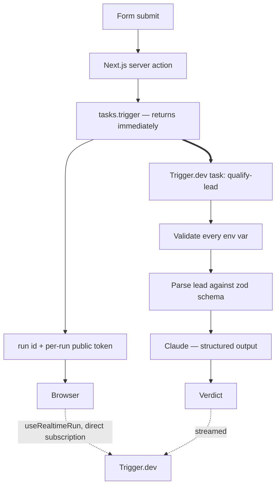

# AI Lead Qualifier — enquiry in, go/no-go out

Describe a lead in a form, and Claude scores it against a written ideal-customer profile:
a tier, a score, nine criteria judged separately with reasons, the questions to ask before
committing, and the terms to get in writing before starting.

Next.js on Vercel for the form, a Trigger.dev task for the scoring, Claude for the
judgment. Built with Claude Code.

**Status:** the scoring half is built and working. The frontend is not — the form and the
results page are the next stage. What's described under *Architecture* is implemented for
the task and designed but unbuilt for the web layer; the section says which is which.

## The problem it solves

A one-person agency has one genuinely scarce resource, and it isn't leads — it's weeks.
Every enquiry looks appealing at 9am on a Monday, and the ones that hurt aren't the
obvious time-wasters. They're the ones that read well, get accepted, and then overrun,
sprawl, or quietly reopen themselves six weeks after sign-off.

So the score isn't a description of how good the enquiry looks. **It's a prediction: will
I be glad I took this?** Two consequences follow from that framing, and they shape the
whole rubric:

- **A lead that reads beautifully and turns into three months of unpaid support was
  scored wrong**, even though nothing in the enquiry was misleading. The qualifier has to
  reason about how the engagement will go, not how the email is written.
- **Every verdict carries a "Protect yourself" section** — what to agree in writing before
  starting, based on how work of this shape actually goes wrong. It appears on strong
  leads too. Especially on strong leads.

## Architecture

The whole design turns on one decision: **the browser never waits on Claude.**



The server action triggers the task and gets back a run ID plus a `publicAccessToken`
scoped to that one run — Trigger.dev generates it at trigger time, so there's no token
endpoint to build. Both go to the browser, which subscribes to Trigger.dev directly.

**Vercel's work is over in about a second.** The lead never sits in a serverless function
waiting on an LLM, so scoring can take as long as it needs — thinking included — without
approaching a function timeout. That's the entire reason for the extra moving part, and
it's the thing not to "simplify" into a route handler that awaits the Anthropic call.

*Implemented:* the task, the scoring, the schemas, the env validation, the dev loop.
*Designed, not yet built:* the form, the results page, the server action.

## Design decisions worth explaining

**The rubric is prose, in one file.** [`src/lib/icp.ts`](./src/lib/icp.ts) holds the
ideal-customer profile as plain English — who the business helps, the nine criteria, how
they're weighed, the disqualifiers, where the tier boundaries sit. Changing what
"qualified" means is a paragraph edit, not a code change. Nothing about scoring lives in
the prompt, the form, or the UI, because criteria scattered across three files drift apart
within a month and no single one of them is the truth any more.

**Silence is never read as absence.** The single rule that overrides the rest. A lead that
doesn't mention budget is not a lead with no budget; an enquiry that names no problem is
not a company without one. Unknown criteria cap how high a lead can score and never drag
it down, and a real business whose only flaw is that nobody has asked it anything yet
can't score below the middle of the nurture band. This sounds obvious and is the single
thing the rubric got wrong twice — see below.

**Structured output, not a paragraph to parse.** The verdict is a zod schema in
[`src/lib/types.ts`](./src/lib/types.ts) converted to JSON Schema and handed to Claude via
`messages.parse()`. The UI renders fields; nothing regex-scrapes prose. The `.describe()`
calls on that schema are prompt text and are edited as prompt text — that's noted at the
top of the file, because the next person to touch it will assume they're documentation.

**`stop_reason` is checked before the content is touched.** A refusal comes back as HTTP
200 with empty or partial content. Read the content first and a refusal surfaces as a
confusing schema-parse failure instead of what actually happened. Truncation at
`max_tokens` gets its own error too, with the fix named in the message — thinking counts
against that budget, so the cap is not the size of the answer.

**Every environment variable is validated before step one.** Not lazily, per variable, on
first use. A lazy check can fire *after* a paid Anthropic call has already run, which
turns a missing config value into a bill. Carried over from a real failure in an earlier
project; there's a standalone `check-env` script so it can be verified without starting a
run at all.

**The Anthropic key is never written to disk on the build machine.** It lives in the
Trigger.dev dashboard, set for both DEV and PROD, and nowhere else — not in Vercel, not in
`.env.local`. `trigger dev` runs the task locally but pulls environment variables from the
dashboard's DEV environment, so local iteration works without a local copy. A local `.env`
value *would* silently override the dashboard's, which is exactly why one must not exist:
`npm run check-env` fails if it finds one.

**Trigger.dev's `syncVercelEnvVars` is deliberately not used.** It pulls Vercel's
environment into Trigger.dev, which is convenient and quietly encourages putting the
Anthropic key in Vercel — where the architecture says it has no reason to be, because the
frontend never calls Claude. If a future change needs that key in Vercel, the architecture
drifted; fix the architecture, not the env.

**Every lead field except two is optional.** A submission arriving with eight blanks is
itself a signal about the lead, and absent fields are rendered to the model as an explicit
`(not provided)` rather than omitted — so it sees the gap instead of inferring one from
the shape of the message.

**The task file is deliberately boring.** [`src/trigger/qualify-lead.ts`](./src/trigger/qualify-lead.ts)
sets run metadata, validates, calls `qualify()`, logs. All the scoring logic is in
`src/lib/` with no Trigger.dev import anywhere in it, so the prompt can be reasoned about
without retry behaviour and run metadata tangled into it — and so the rubric is testable
without a run.

## The bug that shaped the design

The first version of the rubric told the model to let unknown fields drag the score down.
Reasonable-sounding, and wrong in a specific way: it punished leads for being **early**
rather than **bad**.

The tell wasn't the score. It was self-contradiction inside a single verdict — the model
recommended sending a follow-up email while labelling the lead dead. A lead you're about
to email is not a lead you've walked away from.

The fix was prose, not code: unknowns cap a lead at nurture rather than sinking it, and
disqualification now requires a positive reason to say no rather than an absence of
reasons to say yes. A self-check went in with it — **if the recommended next action is to
ask a question, the tier is nurture.**

### The same bug, one level up

It came back. A real accountancy firm with a named pain area scored 38 and was labelled
`nurture` — but the nurture band starts at 40. The model had obeyed the prose rule when
picking the tier and scored the number independently, landing them on opposite sides of
the boundary. Left alone, that lead sorts *below* leads you'd never call, and the number
is what gets scanned in a list.

Two things were wrong, and only one of them was the boundary:

- **An unstated problem was being read as an absent one.** "We think AI could help" was
  marked down as a solution in search of a problem. But every operating business has
  manual processes worth automating — nobody had asked yet. That's the same inference as
  the original bug, moved from *fields* to *the problem itself*, and it's now banned
  globally rather than patched per-criterion.
- **A hard floor was missing.** A real business with no disqualifier, whose only issue is
  unanswered questions, now scores no lower than 45, and the model is required to check
  its own number against its own tier before returning.

**The pattern worth keeping:** when a verdict's recommended action disagrees with its own
tier, the rubric is miscalibrated — not the model. Both times, the contradiction was
visible in the output before anyone thought to question the score.

## Running it

You need a [Trigger.dev](https://trigger.dev) project and an
[Anthropic API key](https://console.anthropic.com). Node 20+.

```bash
npm install
cp .env.example .env.local     # fill in TRIGGER_SECRET_KEY and TRIGGER_PROJECT_ID
```

Set `ANTHROPIC_API_KEY` in the **Trigger.dev dashboard**, under both DEV and PROD. Not in
`.env.local` — `npm run check-env` fails if it finds one there, and explains why.

Two terminals:

```bash
npm run dev:task              # runs the task locally, hot-reloads on save
npm run smoke -- strong-fit   # scores a saved lead, prints the verdict
```

Three fictional test leads ship with it — `strong-fit`, `ambiguous`, `poor-fit` — each
carrying an expected tier as an answer key, so a rubric edit that breaks calibration says
so. `npm run new-lead` saves another.

Editing `src/lib/icp.ts` while `dev:task` is running takes effect on save. That's the
iteration loop; deploying to test a prose change is unnecessary.

| Command | What it does |
|---|---|
| `npm run dev:task` | Run the task on this machine against the dashboard's DEV env |
| `npm run smoke -- <lead>` | Score a saved lead and print the full verdict |
| `npm run smoke -- --prod` | Same, against the deployed task |
| `npm run new-lead` | Save a lead as a test case |
| `npm run check-env` | Verify every key is where it belongs — and isn't where it doesn't |
| `npm run deploy:task` | Deploy the scoring task |
| `npm run dev` | Next.js dev server *(frontend not built yet)* |

### Two deploys, one repo

`git push` deploys **the frontend only**, via Vercel. It does not deploy the task. Any
change to `src/trigger/` or `src/lib/` — including the rubric — needs `npm run deploy:task`
as well.

This is the easiest thing here to forget and the failure is silent: the site looks fine and
quietly scores with yesterday's criteria. If a rubric change doesn't show up in the output,
check this before debugging the prompt.

## Stack

Next.js 16 (App Router) · TypeScript · Tailwind · Trigger.dev 4.5.9 ·
`@trigger.dev/react-hooks` (`useRealtimeRun`) · Anthropic SDK · `claude-sonnet-5`
(effort `high`, structured output via zod) · Vercel · built with Claude Code
